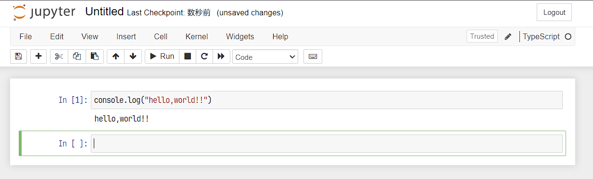

# playground-node-typescript-opencv

This repository is a sample project of OpenCV.js coded in TypeScript in a Jupyter notebook.

## Initialization

```shell
sudo apt install -y jupyter
```

Install tslab.

```shell
npm install -g tslab
tslab install
```

If tslab is recognized as the kernel of Jupyter, you will see the following.

```shell
$ jupyter kernelspec list
Available kernels:
  jslab      /home/node/.local/share/jupyter/kernels/jslab
  tslab      /home/node/.local/share/jupyter/kernels/tslab
  python3    /usr/share/jupyter/kernels/python3
```

Install the dependent npm package.

```shell
npm install
```

## Start notebook server

Start the Notebook server.

```shell
jupyter notebook
```

Once started, access the URL displayed in the console with a browser.
You should be able to create and run a TypeScript notebook.



There are several samples in the notebooks directory for your reference.

## Reference

- [yunabe/tslab-examples: Example notebooks of tslab](https://github.com/yunabe/tslab-examples)
- [OpenCV: Using OpenCV.js](https://docs.opencv.org/4.8.0/d0/d84/tutorial_js_usage.html)
- [OpenCV: Contours : Getting Started](https://docs.opencv.org/4.8.0/d5/daa/tutorial_js_contours_begin.html)
- [うどん県統計情報コーナー | 香川県](https://www.pref.kagawa.lg.jp/tokei/sogo/udonken/kfvn.html)
